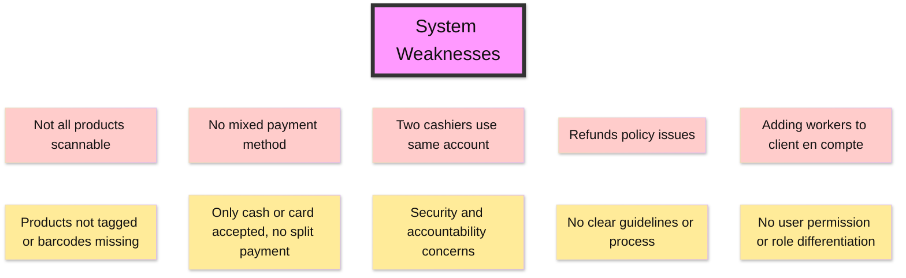
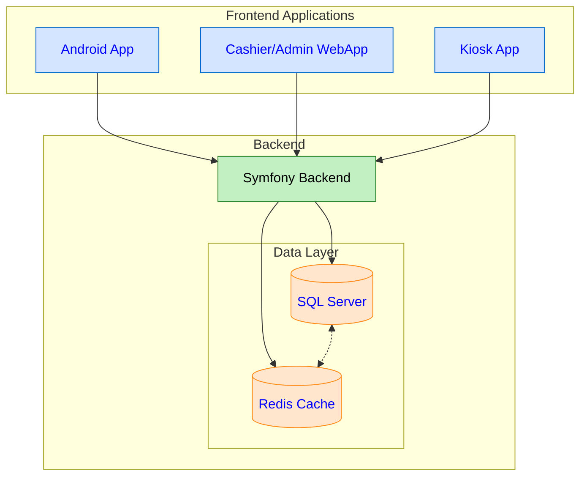
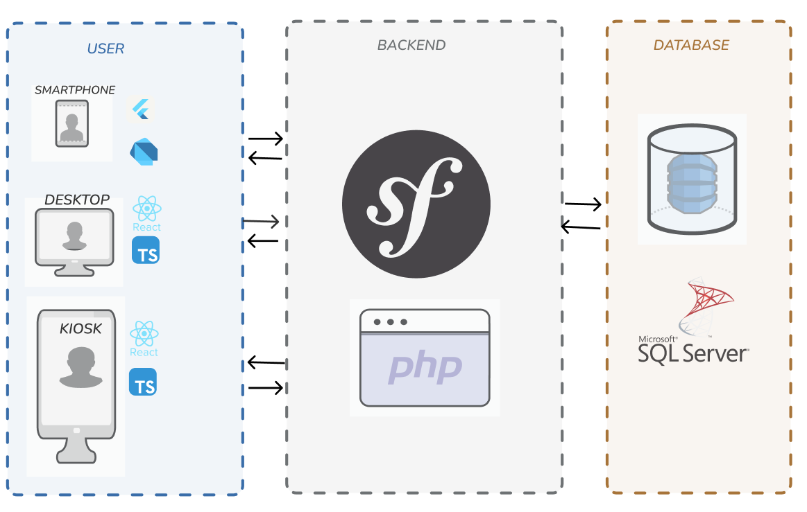
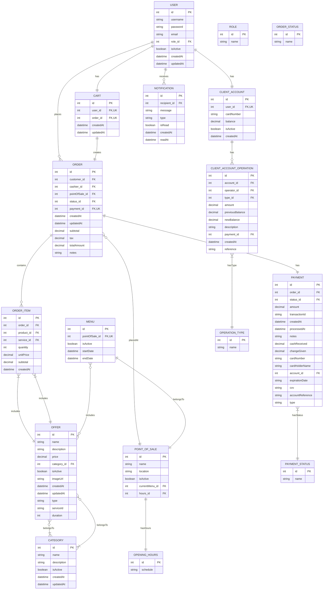
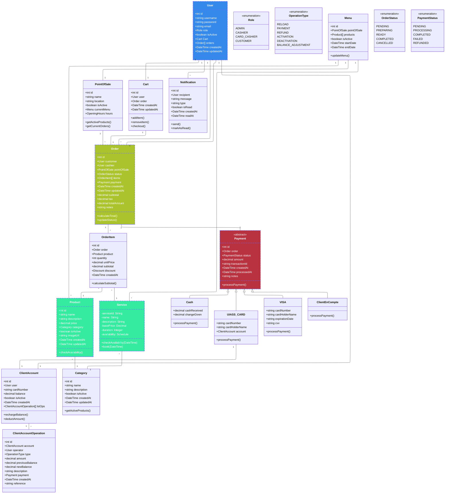
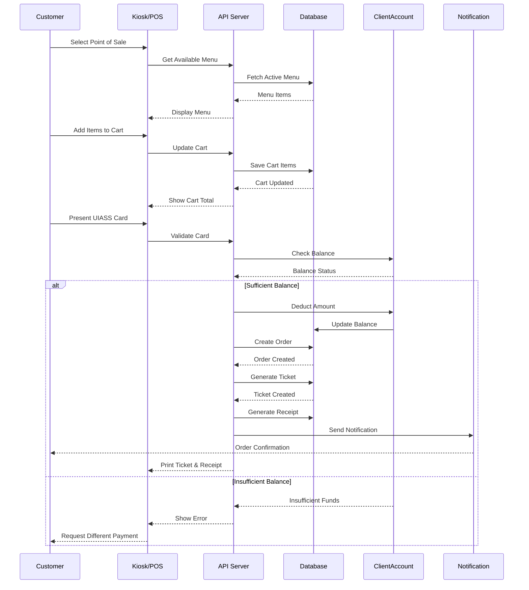
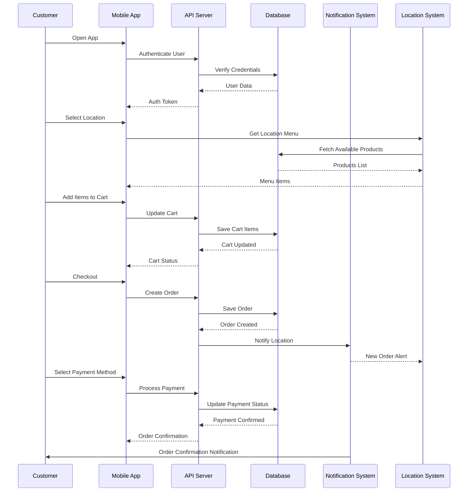
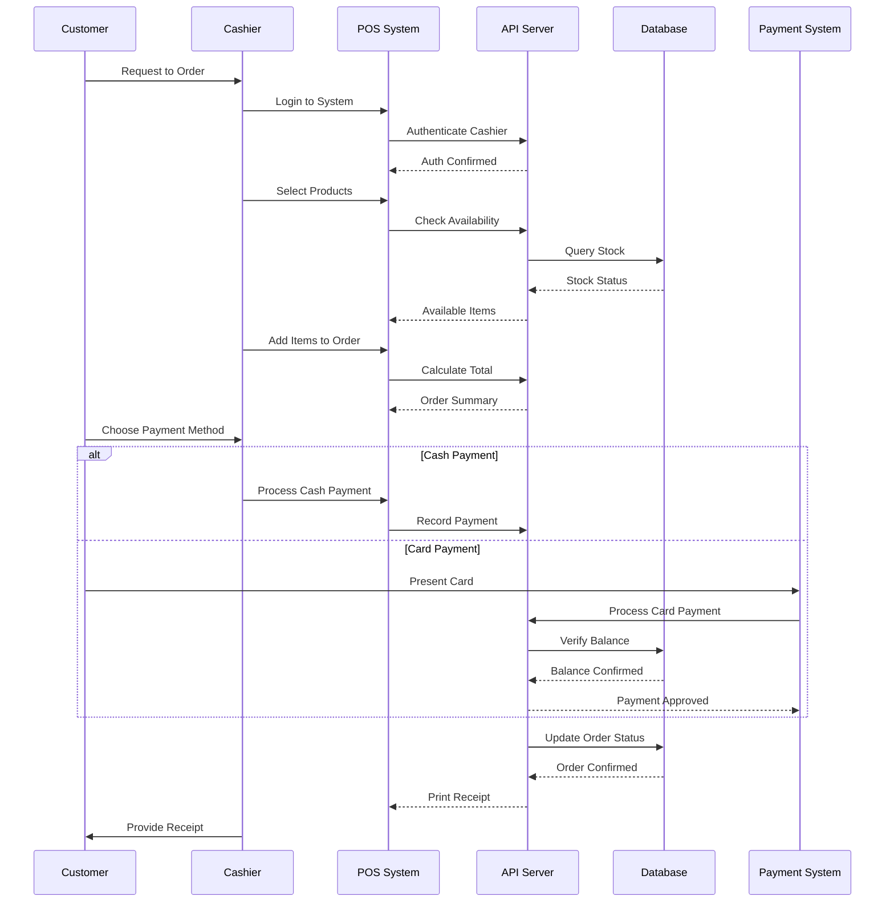
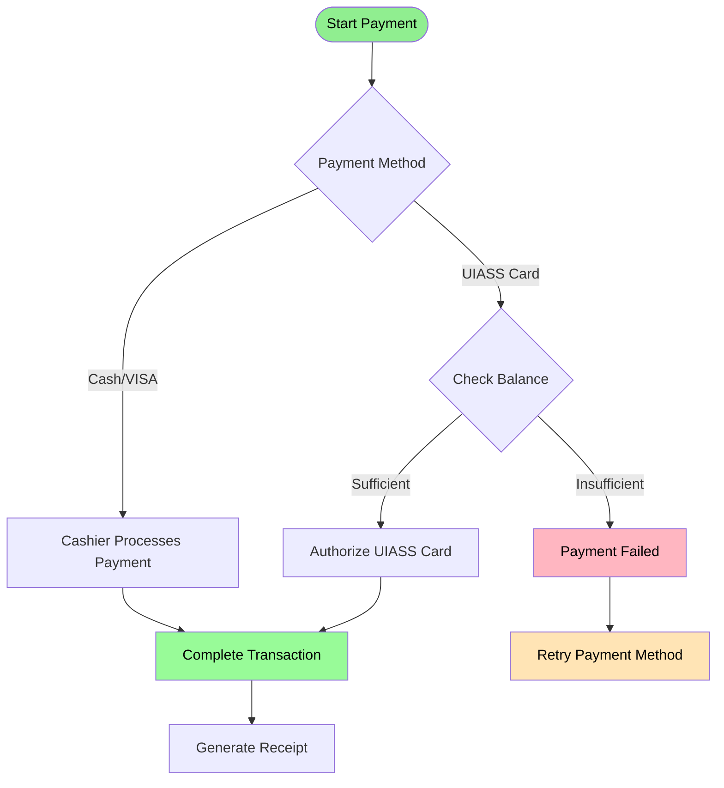

# Vision Document


# UI/UX

[Figma Design](https://www.figma.com/design/aV06U5UlwsO6v4UIStAOF7/Untitled?m=auto&t=N4w2qT0imE5Dk7sG-1)

# Problems




## Overview

This document presents a comprehensive vision for a digital ordering and payment system designed to facilitate transactions in various points of sale. The system integrates multiple front-end applications with a robust backend architecture to ensure seamless operations.

## Technologies

The system leverages modern technologies for high performance and scalability:

- **Frontend:** Android application for customers, web application for cashiers and admins, and a kiosk-based interface for self-service.
- **Backend:** Symfony-based backend for API management, interfacing with a SQL Server database and Redis for caching.
- **Data Layer:** SQL Server for persistent storage and Redis for fast data retrieval.

## System Design

### System Architecture

The system architecture follows a multi-tier structure where frontend applications communicate with the backend, which manages data processing and storage.






## Conception

### Entity Relationship Diagram



### Class Diagram

The following diagram represents the core entities of the system, including users, orders, payments, and inventory management. It ensures clear relationships and responsibilities between various system components.


[Diagram Link](https://mermaid.live/edit#pako:eNqtWI1v2jgU_1eiTFVvOzoVaLs2miZlwDZO5UOETtodp80kBqwmcc52WLke__s9x3ZI0kDbba2U2O_Zz8-_9xnubZ8G2HZsP0ScdwlaMhTN4qOjexITYTn3xyHa0FQcO9YxDm-Pt9ujo1ksF1g3HDNrgGK0xBGOxSzORCjy_Sy24O93EguLBHrCBSPx0kphQYwiXKYmsPc7ZZW1OEIk1KQJDbHF4KHncwpjFFuEu74ga0PuICYs-dDzEQsw--tvi8o318QuEnhKImz5DMMwcEWVkSaBYWzN1TIN9NXevsVxGmGGBKHxu3eK6HYH_aEadlzvU783MZNJ92uZcuNNRwM520o4lfxOSABI1_dpCrjVYpihKxEs4-QjFgzTaJ7TA-yTCIXWHIUo9h-BbC8aJYVGib4tgBlymBowGfZXiC3xe3XWby9zHYLUF24kN0vitvaeudj6C5cxQepdBINm-6m5eC5uukmwJeBRQQRFBQmGmDC8JjTl70twGW6Mv5cZGvUAc5-RRJ6mGWO0kbEA3rxRMXEYXy2H4QVmOBOfY1S-xyGnm_SuR25Xjcful0FvODWMDzdDzXA70_5nd9ofaffs9qqU9-61O-z0vrrdP8A3lZStDvUxo9KUFooDawAq1IT9mILZRgsP7UKkNvofRn5IfVSAcI-PZsf6KQOchBzvzB2DkE80ZdxayadmLLFQ-7XuPHdL4HSUnCw18JJrZsfU6l-8YLIbG646BUIj0ec9MeS4gFQlZ1UGjoMCWaUjqV1JXWOY5yH-0G93cUD8XSIVeEnZBpKLGhy-kZYNYpb4hoU_kmgzhr_C_q27hryP5iQkYlNOHUapn73xc1PhXn1rHS0LHMtSOnuYrQFWo7L8O-GK1g8cy8tULPCk-jXkwh1quHPEQQMQ6VhdZczi1lSlDMfqx4CfqRIZDxWgBrkAf5Aat95jEIPFy8IqwPO2yshQ0Ckki7WavKHo-2udn3JBo7yuKRriK5KTDgdmJt8TSKRcxhq8ioy-wBHELIEX_7EUvtcvTEjxdC6oMObIyQLdVSlylVusTsadqcBGOx-FfhrKM-XqPKepw9U1S_GS37IeYoV-1hqVE5lJY4VN_6QoFmD-itop9InjQtrYc-8u4aqEB3rwGLD5TT0t6OG9tFkPFcdxb9jtDz_qyaQ3dif5dNJzu190OzYajK97017X9GtQCa-v5bSQedgTe7KHoD7fe1AQSKvlBmY4omtcImVxCa15nm9kodbOC1b0MedZitCVQnNysNAc3Av5wiD1qGMoAXWhVNtaaeeFM2IOx4BN-sGT4UiU_g9bpWIs6EVasXJdLCn7DAcZdXqel88rbvHB7V-bsWquKh7CV7mHGExkrppgH0OBCKqsFYqX-CNw4sdvdNN3Pe-r_JDIj9jX-xfon2gIFhzu6uGhdvrA6Z_7nvtT55rvubuEKPwLvY3Zt14_rojSvxd3aJSIXadZuyOLiCEVZEFMh6mEFGkHQhq-a0hCcNWjIzgIiljFzXcfGrvOYoLR010e6AVvh-4vD_QIsVs3E1a82ASH2QWgFMovsUzjmd2c2dbJCQxewWCkwrfKkoOSH-xZkn1Da86rIkfLzTJiZdOeI-X2siVUgqlTWCa5Gr4cjE1N3pW1imq61zqwYmwKm6l0FX4n73ZN37Z3QfaxUFWx2IFUF7wqnl_HzNUvNjX1VjUJ_e1_wJGpp0LaJYwKQ8ZydXspqsB8u2Rz2G_K6aSiaP1nvnZfT2xCzK0FZbAOglJmdS5p6gekBQlD50X77PIKzxsQY_QWOy8uLhZ6fPKdBGLltJK7hk9DypwXi0XOCwAMxBiCdvbcOjdijbmNZDy_WvwaycZPfr1kFQRKLpr7Z63gF2Ghja8kzy_brfZPayz_v337ZjdsKLERIoHt2FlundliBS3_zHZgKD9TZjZkMViHUkG9TezbjmApbtiMpsuV7SxQyGGmOiL9i6RZkqD4T0qLU9u5t-9sp_mm-fr04uyqedq6vDhttpoNe2M7J1ft15ct8KLzq3b79PLN5bZh_5vtb78-u2xdNE_fNNtXzXb7vHXRsHFABGUD_XuofG3_B14p650)



### Use Cases

The system caters to different user roles, each having specific responsibilities and access levels. The main user roles include Admins, Customers, Cashiers, and Card Cashiers.

#### Admin Use Cases

Admins have full control over the system, including managing users, products, inventory, and system settings.

```mermaid
flowchart LR
    classDef actor fill:#f96,stroke:#333,stroke-width:2px,color:#000
    classDef usecase fill:#fff,stroke:#333,stroke-width:2px,color:#000
    
    subgraph Actors
        Admin[("Admin")]:::actor
    end
    
    subgraph "Admin Use Cases"
        direction TB
        UC1["Manage Users"]:::usecase
        UC2["Manage Products"]:::usecase
        UC3["Manage Categories"]:::usecase
        UC4["Manage Point of Sales"]:::usecase
        UC5["View Reports"]:::usecase
        UC6["Manage Inventory"]:::usecase
        UC7["Configure Menus"]:::usecase
        UC8["Manage Discounts"]:::usecase
        UC9["View Transaction History"]:::usecase
        UC10["Manage System Settings"]:::usecase
        UC11["Handle User Complaints"]:::usecase
        UC12["Monitor System Performance"]:::usecase
    end
    
    Admin --> UC1
    Admin --> UC2
    Admin --> UC3
    Admin --> UC4
    Admin --> UC5
    Admin --> UC6
    Admin --> UC7
    Admin --> UC8
    Admin --> UC9
    Admin --> UC10
    Admin --> UC11
    Admin --> UC12

  ```

#### Customer Use Cases

Customers interact with the system primarily to view menus, place orders, track orders, and make payments.

```mermaid
flowchart LR
    classDef actor fill:#f96,stroke:#333,stroke-width:2px,color:#000
    classDef usecase fill:#fff,stroke:#333,stroke-width:2px,color:#000
    
    subgraph Actors
        Customer[("Customer")]:::actor
    end
    
    subgraph "Customer Use Cases"
        direction TB
        UC1["View Menu"]:::usecase
        UC2["Place Order"]:::usecase
        UC3["Track Order"]:::usecase
        UC4["Make Payment"]:::usecase
        UC5["View Order History"]:::usecase
        UC6["Manage Cart"]:::usecase
        UC7["Check UIASS Card Balance"]:::usecase
        UC8["View Notifications"]:::usecase
        UC9["Apply Discount"]:::usecase
        UC10["View Receipt"]:::usecase
    end
    
    Customer --> UC1
    Customer --> UC2
    Customer --> UC3
    Customer --> UC4
    Customer --> UC5
    Customer --> UC6
    Customer --> UC7
    Customer --> UC8
    Customer --> UC9
    Customer --> UC10

```

#### Cashier Use Cases

Cashiers process orders, accept payments, and manage transactions within the system.

```mermaid
flowchart LR
    classDef actor fill:#f96,stroke:#333,stroke-width:2px,color:#000
    classDef usecase fill:#fff,stroke:#333,stroke-width:2px,color:#000
    
    subgraph Actors
        Cashier[("Cashier")]:::actor
    end
    
    subgraph "Cashier Use Cases"
        direction TB
        UC1["Process Orders"]:::usecase
        UC2["Manage Cart"]:::usecase
        UC3["Process Payments"]:::usecase
        UC4["Generate Tickets"]:::usecase
        UC5["Print Receipts"]:::usecase
        UC6["View Order Queue"]:::usecase
        UC7["Update Order Status"]:::usecase
        UC8["Check Inventory"]:::usecase
        UC9["Apply Discounts"]:::usecase
        UC10["Handle Refunds"]:::usecase
    end
    
    Cashier --> UC1
    Cashier --> UC2
    Cashier --> UC3
    Cashier --> UC4
    Cashier --> UC5
    Cashier --> UC6
    Cashier --> UC7
    Cashier --> UC8
    Cashier --> UC9
    Cashier --> UC10


  ```

#### Card Cashier Use Cases

Card cashiers handle UIASS card-related operations such as issuing, recharging, and blocking/unblocking cards.

```mermaid
flowchart LR
    classDef actor fill:#f96,stroke:#333,stroke-width:2px,color:#000
    classDef usecase fill:#fff,stroke:#333,stroke-width:2px,color:#000
    
    subgraph Actors
        CardCashier[("Card Cashier")]:::actor
    end
    
    subgraph "Card Cashier Use Cases"
        direction TB
        UC1["Issue UIASS Cards"]:::usecase
        UC2["Recharge Cards"]:::usecase
        UC3["Check Card Balance"]:::usecase
        UC4["Block/Unblock Cards"]:::usecase
        UC5["View Transaction History"]:::usecase
        UC6["Generate Card Reports"]:::usecase
        UC7["Handle Card Issues"]:::usecase
    end
    
    CardCashier --> UC1
    CardCashier --> UC2
    CardCashier --> UC3
    CardCashier --> UC4
    CardCashier --> UC5
    CardCashier --> UC6
    CardCashier --> UC7

```

## Sequence Diagrams

Sequence diagrams illustrate the dynamic interactions between users and the system.

### UIASS Card Order Process

This sequence diagram details the steps involved when a customer places an order using a UIASS card.



### Mobile Order Placement

This diagram describes the sequence of actions when a customer places an order through the mobile application.




### Cashier Order Processing

The cashier processes orders manually, ensuring order accuracy and efficient payment handling.



## Payment Workflow

The payment process involves multiple methods, including cash, VISA, and UIASS cards. The flowchart below outlines the decision-making process for each payment method.



## Conclusion

This vision document outlines the structure, components, and functionality of the proposed system. With a scalable architecture, clear user roles, and a streamlined transaction process, the system aims to provide an efficient and user-friendly ordering and payment experience.
