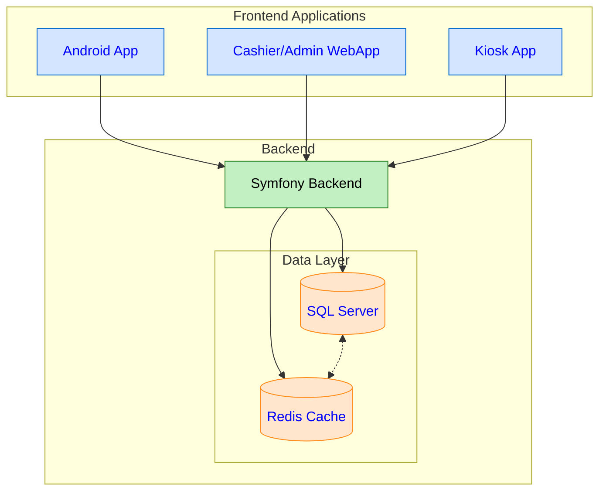

# Technologies


<svg viewBox="0 0 10 10" xmlns="http://www.w3.org/2000/svg" style="background-color: #21ff">
  <rect width="10" height="10">
    <animate
      attributeName="rx"
      values="0;5;0"
      dur="10s"
      repeatCount="indefinite" />
  </rect>
</svg>


*Cette section liste les technologies utilisées dans le système.*

# System Design

*Cette section présente la conception globale du système et son architecture.*

## System Architecture Diagram

*Ce diagramme illustre l'architecture générale du système, montrant comment les différentes applications frontend (Android, Web, Kiosque) interagissent avec le backend Symfony et les bases de données.*



# Conception

*Cette section détaille la conception du système, y compris les diagrammes de classes et les cas d'utilisation.*

## Classes Diagram

*Ce diagramme de classes montre la structure complète du système, définissant toutes les entités et leurs relations. Il inclut les utilisateurs, les comptes clients, les points de vente, les produits, les commandes et plus encore.*

```mermaid
classDiagram
%%{init :{'theme':'dark'}}%%
     
    class User {
        +int id
        +string username
        +string password
        +string email
        +Role role
        +boolean isActive
        +DateTime createdAt
        +DateTime updatedAt
    }

    [... rest of the class diagram ...]
```

## Use Cases

*Cette section décrit les différents cas d'utilisation pour chaque type d'utilisateur du système.*

### Admin:

*Ce diagramme montre toutes les actions possibles pour un administrateur, comme la gestion des utilisateurs, des produits, et des points de vente.*

```mermaid
flowchart LR
    [... Admin use case diagram ...]
```

### Customer:

*Ce diagramme illustre les actions qu'un client peut effectuer, comme voir le menu, passer une commande, et suivre son statut.*

```mermaid
flowchart LR
    [... Customer use case diagram ...]
```

### Cashier:

*Ce diagramme présente les fonctionnalités disponibles pour un caissier, notamment le traitement des commandes et des paiements.*

```mermaid
flowchart LR
    [... Cashier use case diagram ...]
```

### Card Cashier:

*Ce diagramme montre les actions spécifiques au caissier de carte, comme la gestion des cartes UIASS.*

```mermaid
flowchart LR
    [... Card Cashier use case diagram ...]
```

## Sequence diagram

*Cette section présente les diagrammes de séquence qui montrent comment les différents composants du système interagissent.*

### UIASS Card Order Process Sequence

*Ce diagramme montre la séquence d'actions lors d'une commande avec une carte UIASS.*

```mermaid
sequenceDiagram
    [... UIASS Card sequence diagram ...]
```

### Mobile Order Placement Sequence

*Ce diagramme illustre le processus de commande via l'application mobile.*

```mermaid
sequenceDiagram
    [... Mobile order sequence diagram ...]
```

### Cashier Order Processing Sequence

*Ce diagramme détaille le processus de traitement des commandes par le caissier.*

```mermaid
sequenceDiagram
    [... Cashier processing sequence diagram ...]
```

# Payment

*Cette section décrit le processus de paiement avec les différentes méthodes disponibles (carte UIASS, espèces, VISA).*

```mermaid
flowchart TD
    [... Payment flowchart ...]
```
